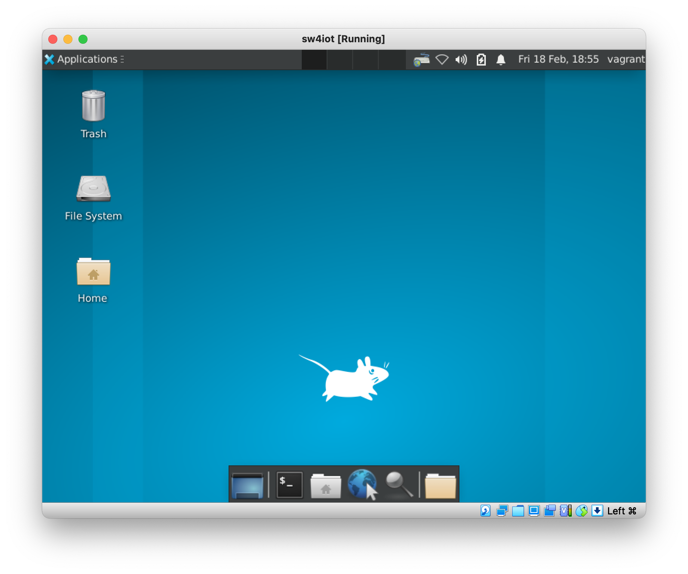

# IoT devices development machine

## Intro

### Why

I teach IoT. My students need to connect to MCUs through Serial Port and tinker with hardware, meaning using Cloud Services for it is not an option.

They have an assorted selection of Operating Systems: different Windows versions, Linux distributions and Mac OS X. So setting up a common environment they all can use makes sense for me as it standardises and simplifies my documentation efforts.

Doing this work in a reproducible way makes even more sense. That's why this repo uses Vagrant to set up an Ubuntu Linux VirtualBox VM configured for IoT development, and shows you how to consume this environment as a Vagrant box right away from Hashicorp's Vagrant Cloud.

### What

The VM has been build using the [Chef's Ubuntu 21.10 Bento Box](https://app.vagrantup.com/bento/boxes/ubuntu-21.10) as a stating point, and then adding an XFCE4 Graphip Environment as a basic UI as well as some other tools and convenient configurations like:

- Python 3 and Python 3 virtual environments
- Minicom with basic setup
- Thonny IDE
- Shared folder between host and guest
- Sensible display configuration options that allow for Display resolution adjustment.
- Spanish keyboard layout

## Getting the VM to work
Getting this VM up and running in your own laptop requires yo follow the next simple steps:

### 1. Get Virtualbox
Download and install [VirtualBox](https://www.virtualbox.org) for you Operating System. If you use Mac OS X as I do, and you use `brew`, installing it is as simple as doing `brew install virtualbox`. If not,
- [Download Virtualbox for your operating system](https://www.virtualbox.org/wiki/Downloads)
- Make sure you follow [your OS specific instructions](https://www.virtualbox.org/manual/ch02.html):
  - [Windows instructions](https://www.virtualbox.org/manual/ch02.html#installation_windows)

### 2. Get Vagrant
Download and install [Vagrant](https://www.vagrantup.com/) for you Operating System. If you use Mac OS X as I do, and you use `brew`, installing it is as simple as doing `brew install vagrant`. If that's not the case, then:
- [Download Vagrant for your operating system](https://www.vagrantup.com/downloads)
-  Make sure you [follow your OS specific instructions](https://www.vagrantup.com/docs/installation#installing-vagrant).

### 3. Get the Vagrant box
This repo has all the necessary artifacts to build a Virtualbox VM as described before with Vagrant.

I've done that for you already by building a [Vagrant box](https://www.vagrantup.com/docs/boxes) that I've published in [Hashicorp's Vagrant Cloud](https://www.vagrantup.com/docs/boxes) as a public image.


## Building the Vagrant image by yourself

Now, clone this repo:

```bash
git clone https://gitlab.com/sw4iot/ubuntu-iot-devel
```

Change to the `ubuntu-iot-devel` directory and launch Vagrant:
```bash
vagrant up
```

Automatic installation should start. Vagrant will download the Ubuntu installation ISO and perform plenty of actions in the VM operating system, so grab a coffee and a cookie while it works.

Once installed, you should see the following screen:



Log in is automatic every time the machine restarts. If you log out, you can log in back into the system with the username `vagrant` and password `vagrant`.

If you wish to connect to the VM via SSH, you can also do:

```bash
vagrant ssh
```

## Building a new Vagrant box

Creating the VM following the steps above takes time, because Vagrant has to:
  download the initial Ubuntu 21.10 bento box from Vagrant Cloud
- install and update the supplementals CD, which involves kernel updates
- upgrade the whole distribution
- download and install certain software.

So, once you've created the Virtualbox image as described before, you can repackage it in the Vagrant *box* format, and publish it so you can consume this new box straight away.

To create a new box, first create the virtualbox VM, and then call the script `gen_box.sh` script:

```bash
./gen_box.sh
```

The script will generate a new box file and will put it by default in the `box/` directory. You can change the box generation configuration by editing the contents of the script.

Now that you have a box file, you can create an account in Hashicorp's Vagrant Cloud and upload your image there. This is what I've done already for you so you can use it as described in the next section.

## Using the new `sw4iot` vagrant box

Following the previous steps, I've created a new Vagrant box based on the modifications in this repo that's published in Vagrant Cloud in [https://app.vagrantup.com/javiercanadillas/boxes/sw4iot](https://app.vagrantup.com/javiercanadillas/boxes/sw4io).


**You don't need to do any of the things described in this `Readme.md`** to build the VM or a new box. The only thing you need to do to use this `sw4iot` VM image is to install Vagrant and Virtualbox as described above, and then create a `Vagrantfile` inside a new directory in your machine containing the following:

```json
Vagrant.configure("2") do |config|
  config.vm.box = "javiercanadillas/sw4iot"
  config.vm.provider "virtualbox" do |vb|
    vb.gui = true
  end
end
```

Once the `Vagrantfile` in your new directory is created, go ahead and launch it:

```bash
vagrant up
```

If you what more details on how to use this newly built VM image, [read this article in Cañadillas's Docs](http://localhost:8000/iot/IoT_Devices_Lab_Series-1/).

## Installed software

For details on what's installed in the image, please read the project's `Vagrantfile` and the linked scripts.

The Ubuntu VM image contains the several basic software packages:

- **XFCE4**: configured with basic tools, lightdm as Display Manager and with the Spanish keyboard layout. See below how to change that configuration.
- **minicom**: with a basic `$HOME/.minirc.dfl` that minicom loads upon launching connecting to `/dev/ttyUSB0` and disabling Hardware flow control, which doesn't seem to work when connecting to the Micropython's REPL running in the ESP32.
- **Thonny**: Graphical IDE very convenient for Micropython.

### Changing the keyboard layout

Open a new terminal straight from the VM UI. Then, to change the keyboard layout to say, french (`fr`), type the following:

```bash
setxkbmap fr
```

Note though that keyboard layout changes done this way won't persist if you reboot your system, and you'll have to reissue this command upon restarts.
